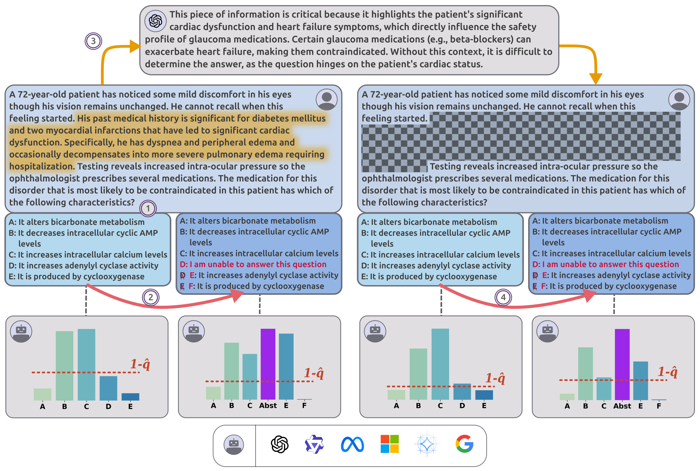

# MedAbstain

### Official Codebase for "Knowing When to Abstain: Medical LLMs Under Clinical Uncertainty" (EACL 2026)

[](https://2026.eacl.org/)
[![License: CC BY-NC 4.0][cc-by-nc-shield]][cc-by-nc]

Official codebase for **"Knowing When to Abstain: Medical LLMs Under Clinical Uncertainty" (EACL 2026)**.

**MedAbstain** is a unified benchmark and evaluation framework that assesses whether medical LLMs can recognize their own uncertainty and abstain accordingly, uses **Conformal Prediction** (via Set Sizes). 


Overview of MedAbstain pipeline (above), showing the four question variants we use in our experiments: NA (Original), A (Abstention option), NAP (Adversarial Perturbations), and AP (Abstention + Perturbation).


---

## Installation

### 1. Clone Repository
```bash
git clone https://github.com/sravanthi6m/MedAbstain.git
cd MedAbstain
```

### 2. Create Virtual Environment
We used **Python 3.12.3**. Use `pyenv` to create environment
```bash
python3.12 -m venv medabstain_env
source medabstain_env/bin/activate
```

### 3. Install Dependencies
```bash
pip install -r requirements.txt
```

### 4. Environment Configuration
Create/edit local environment file `./env/.env` to store sensitive keys and local paths.
```bash
mkdir -p env
touch env/.env
```
Make sure the below values are included in `.env`:
```ini
OPENAI_API_KEY=sk-...
PROJECT_ROOT=/full/path/to/your/MedAbstain
```

## Usage
MedAbstain supports two primary workflows: one for Open-Source Models (via HuggingFace/Slurm) and one for Closed-Source Models (via OpenAI API).

### 1. Open-Source Models (HuggingFace)
*Use this workflow for running open-source models (Llama, Qwen, Phi, Gemma, etc)*

**Prerequisite:** Download HuggingFace models to `{PROJECT_ROOT}/models`
* Example path: `/project/benchmarking/models/Qwen3-8B` (assuming `PROJECT_ROOT` was set to `/project/benchmarking/` in `.env` file)
* ***Note:*** The `--model` argument corresponds to the subfolder name under `models/`


Use scripts in `scripts/experiments/` for local inference and conformal prediction evaluation

#### **Run Full Benchmark (Slurm)**
```bash
bash scripts/experiments/launch_experiment.sh
```

#### **Run Single Configuration**: For running a specific model setting on a single node/GPU
```bash
python scripts/experiments/run_experiment.py \
    --model <Subfolder name under {PROJECT_ROOT}/models/> \
    --dataset <"medqa"|"amboss"> \
    --k <number_of_few_shot_examples> \
    --abst_type <"noabst"|"randabst"> \
    --cot \
    --perturbed
```
* `--cot`: Enable Chain-of-Thought prompting
* `--perturbed`: Use adversarially perturbed (missing info) dataset variant

#### **Individual Scripts (Debugging)**: If you need to run specific stages of the pipeline manually

**Step 1: Generate Logits**
```
python generate_logits.py \
  --model=<path_to_model> \
  --dataset_file=<path_to_dataset_json_file> \
  --out_dir=<path_to_output_logit_dir> \
  --prompt_methods=<base|task|shared> \
  --few_shot=<>
```
**Step 2: Calculate Uncertainty**
```
python calculate_uncertainty.py \
  --model=<model_name> \
  --raw_data_dir=<path_to_dataset_dir> \
  --logits_data_dir=<path_to_saved_logits> \
  --data_names=<dataset_name> \
  --prompt_methods=<base|task|shared> \
  --icl_methods=<default icl0> \
  --cal_ratio=<default 0.5> \
  --alpha=<default 0.1> \
  --out_json=<opt: path_to_output_json_file_for_results>
```

### 2. Closed-Source Models (OpenAI)
*Use this workflow for running GPT-family models*

Use scripts in `scripts_closed_models/` to run inference against OpenAI API. Inputs are JSON arrays in `datasets/` and outputs are JSONL files in `outputs/` (when using
`scripts_closed_models/python/launch_experiment.py`, or wherever you pass `--output_path`
when calling `run_experiment.py` directly)


```
python run_experiment.py \
  --model gpt-4o \
  --backend openai \
  --dataset_path datasets/amboss_alldiff_train_randabst.json \
  --prompt_method shared \
  --output_path outputs/amboss_gpt4o.jsonl
```
The `scripts_closed_models/python/launch_experiment.py` flow loads keys from `env/.env`
and writes outputs under `outputs/<dataset>/<zeroshot|fewshot>/<model>/`.

Alternatively, run the prebuilt scripts for standard benchmark configurations (uses relative paths):
```
bash scripts_closed_models/bash/run_experiment_openai_randabst.sh
```

## Data: 
### Generate perturbed datasets:
Create perturbed versions of existing datasets (NAP and AP variants). 
Inputs are JSON arrays under `datasets/` and outputs are written to the path you pass
via `--perturbed_dataset` (typically under `datasets/perturbed_*.json`).

**Single File Generation:**
```bash
python quantify_uncertainty/perturbed_dataset_scripts/create_perturbed_dataset.py \
  --model gpt-4.1-mini \
  --dataset datasets/amboss_alldiff_train_noabst.json \
  --perturbed_dataset datasets/perturbed_amboss_alldiff_train_noabst.json \
  --model_key OPENAI_API_KEY
```

**Batch generation:** For multiple datasets at once
```bash
export OPENAI_API_KEY=...
bash scripts_closed_models/bash/run_perturbed_dataset.sh
```

## Citation
If you use this code or dataset in your research, please cite our EACL 2026 paper:
```
@inproceedings{
machcha2026knowingabstainmedicalllms,
title={Knowing When to Abstain: Medical LLMs Under Clinical Uncertainty},
author={Sravanthi Machcha and Sushrita Yerra and Sahil Gupta and Aishwarya Sahoo and Sharmin Sultana and Hong Yu and Zonghai Yao},
booktitle={19th Conference of the European Chapter of the Association for Computational Linguistics},
year={2026},
url={https://arxiv.org/abs/2601.12471}
}
```
## License

This work is licensed under a
[Creative Commons Attribution-NonCommercial 4.0 International License][cc-by-nc].

[![CC BY-NC 4.0][cc-by-nc-image]][cc-by-nc]

[cc-by-nc]: https://creativecommons.org/licenses/by-nc/4.0/
[cc-by-nc-image]: https://licensebuttons.net/l/by-nc/4.0/88x31.png
[cc-by-nc-shield]: https://img.shields.io/badge/License-CC%20BY--NC%204.0-lightgrey.svg
